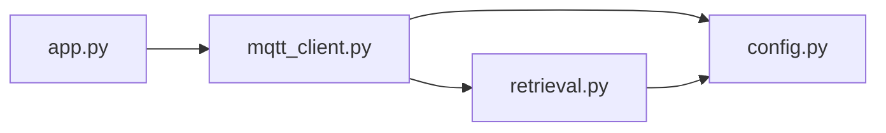
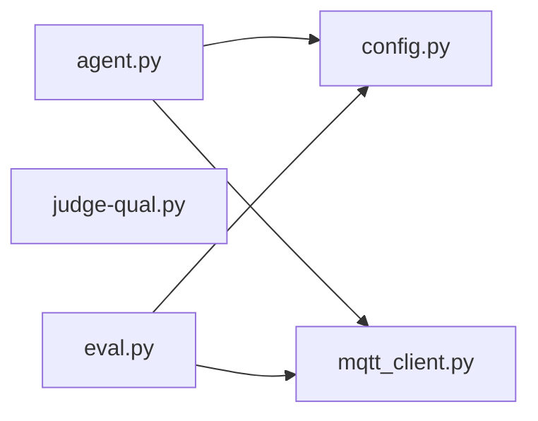

# Supply Chain Assistant
**– Development Notes**
## Version 0.1.0

### Model Selection
- Chose **Llama** because it is free to use.
- Selected the **Llama 3.2 1B** model because it is relatively new, provides good accuracy, and can run on the available hardware within a reasonable processing time.

### Embedding Model
- Used the **mxbai-embed-large** embedding model because its large number of parameters allows it to generate high-quality embeddings efficiently.

### Vector Database
- Selected **Qdrant** to prepare for scaling up to **1 million vectors**.
- Deployed Qdrant using **Docker**, following the recommendation from the Qdrant developers to reduce the risk of data loss.
- Configured the following port mappings:
  - `6333:6333`
  - `6334:6334`
- On Windows, installed **WSL (Windows Subsystem for Linux)** to enable Docker support.

### Project Structure
- Split the implementation into two files:
  - `vector.py` handles the connection and communication with the vector database.
  - The remaining application logic is kept separate for better organization.

### Data and Prompt
- Used a **CSV dataset** for simplicity and ease of implementation.
- Hardcoded the user prompt to simplify the initial implementation.

---

## Version 0.2.0

### Test Cases
- Created **36 manual test cases** which is about 1 third of the dataset, covering multiple testing categories.
- Test generation did **not** include the prompt template.

### LLM Judge
- Implemented an **LLM-as-a-Judge** evaluation pipeline using the same Llama model.
- The judge compares:
  - the user query,
  - the expected answer, and
  - the generated RAG response.
- The judge assigns a score to each response according to the following criteria:

| Score | Criteria |
|------:|----------|
| **5** | Completely correct. Contains all expected information. |
| **4** | Mostly correct. Missing only minor details. |
| **3** | Partially correct. Some important information is missing. |
| **2** | Mostly incorrect. |
| **1** | Incorrect. |
| **0** | Completely incorrect or hallucinated. |

### Evaluation Results
- The LLM judge produced an **average score of approximately 3**, indicating that the RAG system achieved **partially correct** responses on average.

---

## Version 0.3.0

### Dataset Scaling
- Created `data_gen.py` to generate a synthetic dataset containing **1 million rows** with **4 columns**.

### Database Updates
- Deleted the existing Qdrant collection.
- Reloaded the database with the **1 million-row dataset**.
- Captured the processing time in a separate log file.
- Deleted the collection again and reloaded the original **124-row dataset**.
- Captured the processing time in another log file.

### Retrieval Improvements
- Modified `retrieval.py` to:
  - process data in chunks, and
  - upload embeddings to Qdrant in batches.

### Embedding Model Optimization
- Replaced **mxbai-embed-large** with **qllama/bge-small-en-v1.5** due to significantly faster embedding performance.

#### Performance Comparison

| Embedding Model | Dataset | Processing Time |
|-----------------|---------|----------------:|
| `mxbai-embed-large` | 124 rows | **55.35 s** |
| `qllama/bge-small-en-v1.5` | 124 rows | **25.49 s** |
| `qllama/bge-small-en-v1.5` | 1,000,000 rows | **56,680.25 s (~15.7 hours)** |

- The previous embedding model was estimated to require **approximately three days** to process the 1 million-row dataset.
- Both embedding models achieved the **same evaluation results**, making the smaller model the preferred choice.

> **Note:** The machine used during this phase is later referred to as the **Frontend** machine.

---

## Version 1.0.0

### Infrastructure Changes
- The **Frontend** machine began running out of storage.
- Installed **Qdrant** on a separate machine, referred to as the **Backend**, and loaded the CSV dataset as the only collection.
- Installed the **Mosquitto MQTT broker** on the Backend machine.

### Backend Development
- Developed a data extraction script on the Backend.
- Implemented an MQTT client on the Backend.
- Configured the MQTT broker to bind to `0.0.0.0`.

### Frontend Development
- Implemented an MQTT client on the Frontend machine (the machine that originally hosted Ollama).
- Modified the evaluation pipeline on the Frontend to communicate through MQTT.

### System Architecture

With the introduction of separate Frontend and Backend machines, the application was restructured into a distributed architecture. Communication between the two systems is handled through MQTT, allowing the Frontend to send requests while the Backend performs retrieval and data access.

#### Backend

The Backend is responsible for data retrieval and communication with the Qdrant vector database. It exposes its functionality through an MQTT client that receives requests from the Frontend.

#### Frontend

The Frontend hosts the LLM agent, evaluation pipeline, and configuration. Both the agent and evaluation modules communicate with the Backend through MQTT, while the LLM judge remains an independent evaluation component.

---

# Appendix

## A. Frontend

| Component | Specification |
|-----------|---------------|
| CPU | Intel® Core™ i5-3317U @ 1.70 GHz |
| RAM | 8 GB |
| Graphics | Intel® HD Graphics 4000 |

## B. Backend

| Component | Specification |
|-----------|---------------|
| CPU | Intel® Core™ i3-6100U @ 2.30 GHz |
| RAM | 8 GB |
| Graphics | Intel® HD Graphics 520 (Integrated) |
